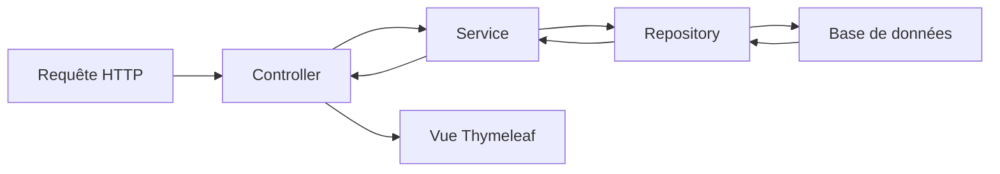

# Gestion Immobilière – Documentation complète et détaillée

## Table des matières
1. [Contexte et objectifs](#contexte-et-objectifs)  
2. [Prérequis et installation](#prérequis-et-installation)  
3. [Architecture et arborescence](#architecture-et-arborescence)  
4. [Flux global des requêtes](#flux-global-des-requêtes)  
5. [Description détaillée des composants](#description-détaillée-des-composants)  
   - [Configuration (config)](#configuration-config)  
   - [Modèles (model)](#modèles-model)  
   - [Dépôts (repository)](#dépôts-repository)  
   - [Services (service)](#services-service)  
   - [Contrôleurs (controller)](#contrôleurs-controller)  
   - [Utilitaires (util)](#utilitaires-util)  
6. [Fonctionnements internes pas à pas](#fonctionnements-internes-pas-à-pas)  
   - [Inscription et hachage](#inscription-et-hachage)  
   - [Login et authentification](#login-et-authentification)  
   - [2FA – deux facteurs](#2fa-–-deux-facteurs)  
   - [Ajout/édition de biens](#ajoutédition-de-biens)  
   - [Recherche de biens](#recherche-de-biens)  
   - [Enregistrement d’une transaction](#enregistrement-dune-transaction)  
7. [Sécurité approfondie](#sécurité-approfondie)  
8. [Exemples de parcours utilisateur détaillés](#exemples-de-parcours-utilisateur-détaillés)  
9. [Tests et journalisation](#tests-et-journalisation)  
10. [Contribution et bonnes pratiques](#contribution-et-bonnes-pratiques)  

---

## Contexte et objectifs
Cette application gère un parc de biens immobiliers :
- **Propriétaires** : ajouter, modifier, supprimer leurs biens, consulter le bilan financier  
- **Clients** : rechercher, louer ou acheter un bien, consulter leur profil  
- **Administrateurs** : supervision globale  

Objectifs :
1. Sécurité (hachage, 2FA, CSRF)  
2. Facilité d’usage (Thymeleaf, formulaires clairs)  
3. Fiabilité (logs, tests)  

## Prérequis et installation
- Java 17, Maven  
- Base de données H2/MariaDB/MySQL (configurable dans `application.properties`)  
- Créer `upload-dir/images`  
- Importez le projet dans votre IDE (IntelliJ, Eclipse, VSCode) ou copiez manuellement le dossier `gestion_immobiliere` dans votre espace de travail.  
- Placez-vous dans le répertoire racine du projet :
  ```bash
  cd gestion_immobiliere
  ./mvnw clean package
  ./mvnw spring-boot:run
  ```  
- Accédez à l’application via `http://localhost:8080`

## Architecture et arborescence
```
src/
 ├─ main/
 │   ├─ java/com/realestate/gestion_immobiliere/
 │   │   ├─ config/         Configuration MVC & sécurité
 │   │   ├─ model/          Entités et DTO
 │   │   ├─ repository/     Interface et implémentations DB
 │   │   ├─ service/        Logique métier
 │   │   ├─ controller/     Gestion des endpoints HTTP
 │   │   └─ util/           Helpers : fichiers, email, mot de passe
 │   └─ resources/
 │       ├─ static/         CSS, JS, images
 │       └─ templates/      Vues Thymeleaf
 └─ test/                   Tests unitaires
```

Schéma de flux (MVC) :


## Description détaillée des composants

### Configuration (config)
- **MvcConfig.java**  
  - Méthode `addViewControllers(ViewControllerRegistry)` : mappe `/login`, `/register`, etc. aux templates  
  - Méthode `addResourceHandlers(ResourceHandlerRegistry)` : expose `upload-dir/images/**`  
- **SecurityConfig.java** (si présent)  
  - Définit les règles Spring Security : URL publiques, login form, logout  

### Modèles (model)
- **User** (`@Entity`)  
  - `Long id`, `String email`, `String passwordHash`, `String secret2FA`, `Role role`  
- **Bien**  
  - `Long id`, `String title`, `String description`, `Double price`,  
    `TypeBien type`, `User owner`, `String imageFilename`  
- **Transaction**  
  - `Long id`, `Bien bien`, `User client`, `LocalDate date`, `Double montant`  
- **FinancialSummary** (non-entity)  
  - Agrégation : `double totalRevenus`, `int nombreTransactions`  
- **Type**, **TypeBien**, **ClientDTO** : data transfer  

### Dépôts (repository)
- **UserRepository extends JpaRepository<User, Long>**  
  - Méthodes générées : `findByEmail(String)`  
- **BienRepository extends JpaRepository<Bien, Long>**  
- **TransactionRepository extends JpaRepository<Transaction, Long>**  
  - Méthode personnalisée : `List<Transaction> findByBienOwner(User owner)`  
- **BienJdbcRepository**  
  - Méthode `List<Bien> searchByKeyword(String keyword)` :  
    - Création de requête SQL avec `LIKE %keyword%` sur titre et description  

### Services (service)
- **UserService**  
  - `register(User user)` :  
    1. Vérifie unicité email  
    2. `PasswordUtil.hashPassword(raw)`  
    3. `userRepository.save(user)`  
  - `enable2FA(User user)` :  
    1. `Base32` secret généré  
    2. Sauvegarde du `secret2FA`  
  - `validateOTP(User user, String code)` :  
    - Utilise TOTP library pour valider  
- **BienService**  
  - `List<Bien> listAll()`  
  - `Bien getById(Long id)`  
  - `Bien create(Bien b, MultipartFile file)` :  
    - Sauvegarde image → `FileUploadUtil.saveFile(...)`  
    - Persiste entité  
  - `void delete(Long id)`  
- **TransactionService**  
  - `void record(Bien bien, User client, LocalDate date, double montant)`  
  - `FinancialSummary computeSummary(User owner, Period period)`  

### Contrôleurs (controller)
- **HomeController**  
  - `@GetMapping("/")` : redirige selon rôle (`ROLE_PROPRIETAIRE` → `/biens/list`, sinon `/search`)  
- **UserController** (`/users`)  
  - `@GetMapping("/register")` et `@PostMapping("/register")` : formulaire et traitement  
  - `@GetMapping("/login")` (Spring Security gère POST)  
  - `@GetMapping("/2fa")`, `@PostMapping("/2fa")` : génération et vérification du code  
  - `@GetMapping("/profile")` : affiche données utilisateur  
- **BienController** (`/biens`)  
  - `@GetMapping("/list")` : liste paginée  
  - `@GetMapping("/add")`, `@PostMapping("/save")`  
  - `@GetMapping("/edit/{id}")`, `@PostMapping("/update")`  
  - `@GetMapping("/delete/{id}")`  
- **TransactionController** (`/transactions`)  
  - `@GetMapping("/new/{bienId}")`, `@PostMapping("/record")`  
  - `@GetMapping("/summary")`  
- **CustomErrorController**  
  - Implémente `ErrorController` pour personnaliser /error  

### Utilitaires (util)
- **PasswordUtil**  
  - `static String hashPassword(String raw)` → BCrypt  
  - `static boolean verify(String raw, String hash)`  
- **FileUploadUtil**  
  - `static void saveFile(String uploadDir, String fileName, MultipartFile file)`  
  - `static void cleanDir(String dir)`  
- **EmailSender**  
  - Envoi simple via `JavaMailSender`  

## Fonctionnements internes pas à pas

### Inscription et hachage
1. L’utilisateur POST `/users/register`  
2. `UserController.register()`  
3. Appelle `PasswordUtil.hashPassword(raw)` :  
   ```java
   return BCrypt.hashpw(raw, BCrypt.gensalt());
   ```  
4. Enregistre le nouvel User  

### Login et authentification
1. Spring Security intercepte `/login`  
2. Compare `rawPwd` et `passwordHash` via `PasswordUtil.verify`  
3. Si succès et 2FA inactif → session initiée  
4. Sinon redirection vers `/users/2fa`

### 2FA – deux facteurs
1. `UserController.enable2FA()` génère un secret via `new Base32()`  
2. Affiche QR code dans `2FA.html`  
3. L’utilisateur scanne avec Google Authenticator  
4. À chaque login, POST `/users/2fa` vérifie le code :
   ```java
   GoogleAuthenticator gAuth = new GoogleAuthenticator();
   return gAuth.authorize(user.getSecret2FA(), Integer.parseInt(code));
   ```

### Ajout/édition de biens
1. GET `/biens/add` → formulaire Thymeleaf  
2. POST `/biens/save` reçoit `BienDto` + `MultipartFile`  
3. `FileUploadUtil.saveFile("upload-dir/images", filename, file)`  
4. `bien.setImageFilename(filename)`  
5. `bienService.create(bien)`  

### Recherche de biens
1. GET `/search?keyword=xxx`  
2. `BienController.search()`  
3. `bienJdbcRepository.searchByKeyword(keyword)`  
4. Monte liste en attribut Thymeleaf  

### Enregistrement d’une transaction
1. GET `/transactions/new/{bienId}`  
2. Formulaire avec date et montant  
3. POST `/transactions/record`  
4. `transactionService.record(...)`  
5. Redirection `/transactions/summary`  

## Sécurité approfondie
- **CSRF** : token automatique injecté dans les formulaires  
- **Sessions** : timeout configurable (`server.servlet.session.timeout`)  
- **Headers HTTP** : HSTS, X-Content-Type-Options, X-Frame-Options via `SecurityConfig`  

## Exemples de parcours utilisateur détaillés
1. **Propriétaire – Ajout d’un bien**  
   - Login → `/biens/add` → upload → persistance → redirection  
2. **Client – Recherche et transaction**  
   - `/search` → liste → choix → `/transactions/new/{id}` → enregistrement → résumé  

## Tests et journalisation
- **Tests** : JUnit 5, SpringBootTest  
- **Logs** : Logback → `app.log` (INFO, DEBUG)  
- Couverture critique sur services et controllers  

## Contribution et bonnes pratiques
- Fork & clone  
- Brache `feat/xyz` ou `fix/abc`  
- Conventional commits  
- Tests unitaires obligatoires  
- Revues de code via pull request  

---
*Documentation exhaustive du projet « Gestion Immobilière ».*
